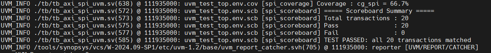
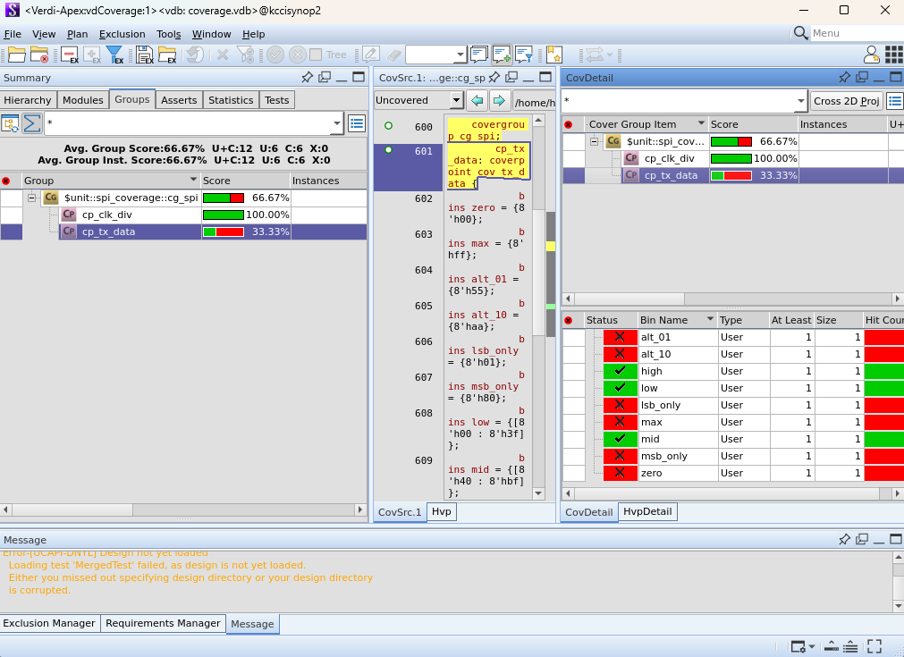

# AXI4-Lite Peripheral IP and Software Verification

This project implements custom GPIO, SPI, I2C, and UART peripherals as AXI4-Lite slave IPs and integrates them with a MicroBlaze-based processor system.

The hardware peripherals are accessed through memory-mapped registers from Vitis C software. The project covers RTL wrapper design, AXI4-Lite register access, hardware-software integration, and verification.

---

## Project Goals

- Understand the AXI4-Lite read and write channel handshake
- Design memory-mapped peripheral registers
- Wrap existing GPIO, SPI, I2C, and UART RTL as AXI4-Lite slave IPs
- Connect custom IPs to a MicroBlaze-based Vivado system
- Access peripheral registers from Vitis C/HAL software
- Verify peripheral operation through simulation, UVM, and software tests

---

## System Architecture

```text
Vitis C Application
        |
        v
Application / Driver / HAL
        |
        v
MicroBlaze Processor System
        |
        v
AXI Interconnect
        |
        +----------------+----------------+----------------+----------------+
        |                |                |                |
        v                v                v                v
 AXI4-Lite GPIO    AXI4-Lite SPI    AXI4-Lite I2C    AXI4-Lite UART
        |                |                |                |
        v                v                v                v
   GPIO Logic       SPI Master/       I2C Master/       UART TX/RX
                    Slave Logic       Slave Logic
```

The processor accesses each peripheral through a base address assigned in the Vivado address map. Software reads and writes the custom slave registers using memory-mapped I/O.

---

## AXI4-Lite Interface

AXI4-Lite uses five independent channels for single-beat memory-mapped transfers.

| Channel | Main Signals | Purpose |
|---|---|---|
| Write Address | `AWADDR`, `AWVALID`, `AWREADY` | Transfers the target register address |
| Write Data | `WDATA`, `WSTRB`, `WVALID`, `WREADY` | Transfers write data and byte enables |
| Write Response | `BRESP`, `BVALID`, `BREADY` | Reports write completion and status |
| Read Address | `ARADDR`, `ARVALID`, `ARREADY` | Transfers the target register address |
| Read Data | `RDATA`, `RRESP`, `RVALID`, `RREADY` | Returns register data and read status |

### Write Flow

```text
Write Address + Write Data
            |
            v
   AXI4-Lite Slave Register
            |
            v
      Write Response
```

### Read Flow

```text
Read Address
     |
     v
AXI4-Lite Slave Register
     |
     v
Read Data + Read Response
```

---

## Peripheral IPs

| Peripheral | RTL Files | Integration Focus |
|---|---|---|
| GPIO | `GPIO/GPIO8_v1_0.v`, `GPIO/GPIO8_v1_0_S00_AXI.v` | Memory-mapped input/output register access |
| SPI | `SPI/SPI_v1_0.v`, `SPI/SPI_v1_0_S00_AXI.v` | AXI register control, SPI transfer, UVM and software verification |
| I2C | `I2C/I2C_v1_0.v`, `I2C/I2C_v1_0_S00_AXI.v` | AXI register control, I2C transfer, Vitis HAL access |
| UART | `UART/uart_v1_0.v`, `UART/uart_v1_0_S00_AXI.v` | AXI register control, UART operation, interrupt-based software application |

Each top-level peripheral file connects the protocol-specific RTL to the generated AXI4-Lite slave interface in the corresponding `_S00_AXI` module.

---

## Hardware-Software Integration

The Vitis software follows a layered structure so that application logic is separated from low-level register access.

```text
Application Layer (`ap`)
          |
          v
Driver Layer (`driver`)
          |
          v
Hardware Abstraction Layer (`HAL`)
          |
          v
AXI4-Lite Peripheral Registers
```

| Layer | Responsibility |
|---|---|
| Application | Implements the test scenario and peripheral behavior |
| Driver | Provides reusable control functions for buttons, LEDs, switches, and FND |
| HAL | Reads and writes memory-mapped GPIO, SPI, I2C, UART, and timer registers |
| Hardware | Executes the peripheral function in custom RTL |

This structure allows the same application logic to use clear software APIs without directly handling AXI register addresses in every module.

---

## Verification Strategy

The project verifies both the AXI4-Lite register interface and the connected peripheral behavior.

| Verification Level | Verification Focus |
|---|---|
| RTL Simulation | AXI read/write handshake and peripheral control behavior |
| Register Test | Correct write/read access to memory-mapped slave registers |
| UVM Testbench | Randomized AXI-SPI transactions, monitoring, scoreboard comparison, and coverage |
| Vitis Software | Peripheral access through C/HAL APIs |
| System Integration | MicroBlaze, AXI interconnect, custom IP, and software operation |

### AXI-SPI UVM Verification

The SPI directory contains a dedicated SystemVerilog UVM testbench (`SPI/VITIS/tb_axi_spi_uvm.sv`). The testbench drives randomized AXI transactions, observes SPI behavior, compares expected and actual results, and collects functional coverage.

---

## Repository Structure

```text
AXI/
|-- README.md
|-- STUDY
|-- GPIO/
|   |-- GPIO8_v1_0.v
|   `-- GPIO8_v1_0_S00_AXI.v
|-- SPI/
|   |-- SPI_v1_0.v
|   |-- SPI_v1_0_S00_AXI.v
|   |-- Sim_Result/
|   |-- Coverage_verdi/
|   `-- VITIS/
|       |-- tb_axi_spi_uvm.sv
|       `-- src/
|           |-- HAL/
|           |-- driver/
|           |-- ap/
|           |-- common/
|           `-- main.c
|-- I2C/
|   |-- I2C_v1_0.v
|   |-- I2C_v1_0_S00_AXI.v
|   `-- VITIS/
|       `-- src/
|           |-- HAL/
|           |-- driver/
|           |-- ap/
|           |-- common/
|           `-- main.c
`-- UART/
    |-- uart_v1_0.v
    |-- uart_v1_0_S00_AXI.v
    `-- VITIS/
        `-- src/
            |-- HAL/
            |-- driver/
            |-- ap/
            |-- common/
            `-- main.c
```

---

## Results

### AXI-SPI Simulation



### AXI-SPI Functional Coverage



---

## Key Takeaways

- Designed custom AXI4-Lite slave wrappers for multiple peripherals
- Connected protocol RTL to memory-mapped control and status registers
- Integrated custom IP with a MicroBlaze processor system
- Built layered Vitis C/HAL software for peripheral access
- Verified hardware and software operation at simulation and system levels

---

## Presentation

- [SoC AXI Peripheral Integration](https://github.com/user-attachments/files/28446928/260508_SoC_AXI_Peripheral_.pdf)

---

[Back to the UVM Verification Projects](../README.md)

